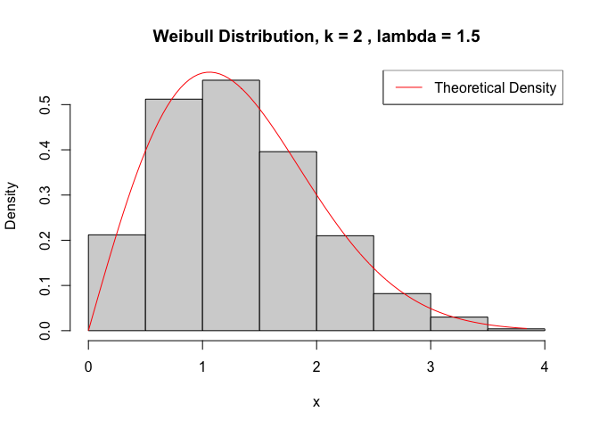
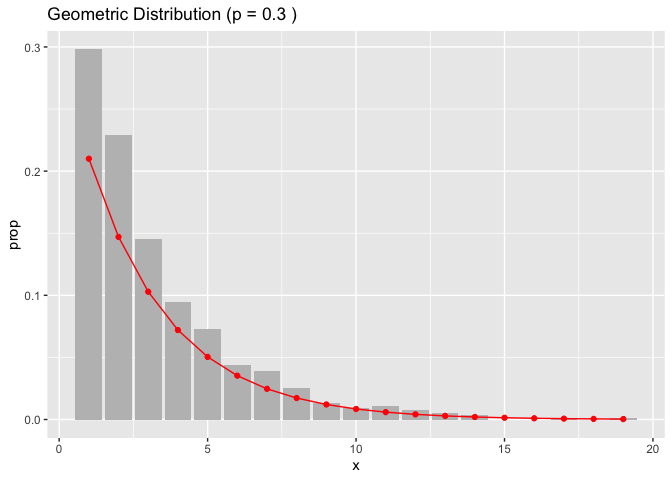
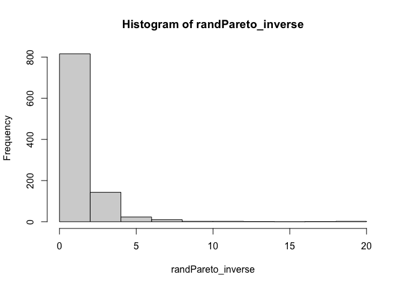
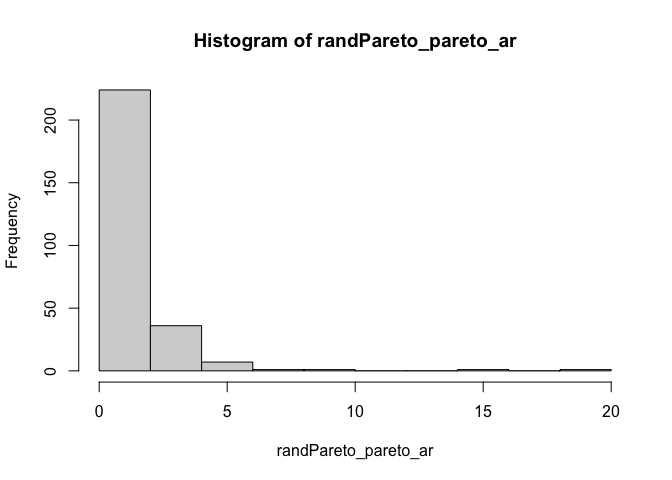

Homework 1
================
Minghe Wang
2025-03-07

# Problem 1: Generating Weibull-Distributed Random Numbers

The **Weibull distribution** is commonly used in reliability engineering
and survival analysis. The PDF is:

$$ f(x) = \frac{k}{\lambda} \left( \frac{x}{\lambda} \right)^{k-1} e^{-(x/\lambda)^k}, \quad x > 0. $$

### **Tasks**

1.  Implement an R function to generate **1000 Weibull-distributed
    random numbers** using the inverse CDF method, with parameters
    $k = 2$ and $\lambda = 1.5$.
2.  Plot a histogram of the generated samples and overlay the
    theoretical density.
3.  Compute and compare the sample mean and variance with the
    theoretical values.

``` r
# 1. Implement inverse CDF function
generate_wb <- function(n, k, lambda) {
  u <- runif(n)
  # inverse F(u)
  x <- lambda * (-log(1-u))^(1/k)
  return(x)
}

n <- 1000
k <- 2
lambda <- 1.5

set.seed(20250217)
randWb <- generate_wb(n, k, lambda)

# 2. Plot histogram and density
hist(randWb, probability = TRUE, main = paste('Weibull Distribution, k =', k, ', lambda =', lambda), xlab = 'x')
curve((k / lambda) * ((x / lambda)^(k - 1)) * exp(- (x / lambda)^k), from = 0, to = max(randWb), add = TRUE, col = 'red')
legend("topright", legend = "Theoretical Density", col = "red", lwd = 1)
```

<!-- -->

``` r
# 3. compare mean and variance with theoretical values
sampleWb_mean <- mean(randWb)
sampleWb_var <- var(randWb)

theoreticalWb_mean <- lambda * gamma(1 + 1/k)
theoreticalWb_var <- lambda^2 * (gamma(1 + 2/k) - (gamma(1 + 1/k))^2)

cat("Sample mean = ", sampleWb_mean, '; theoretical mean = ', theoreticalWb_mean)
```

    ## Sample mean =  1.313484 ; theoretical mean =  1.32934

``` r
cat("Sample variance = ", sampleWb_var, '; theoretical variance = ', theoreticalWb_var)
```

    ## Sample variance =  0.4672501 ; theoretical variance =  0.4828541

------------------------------------------------------------------------

# Problem 2: Generating Geometric-Distributed Random Numbers

The **Geometric distribution** models the number of trials until the
first success. The PDF is:

$$ f(x) = p (1 - p)^{x-1}, \quad x = 1, 2, 3, \ldots $$

### **Tasks**

1.  Implement an R function to generate **1000 Geometric-distributed
    random numbers** with $p = 0.3$.
2.  Plot a barplot of the generated numbers and overlay the theoretical
    PMF.
3.  Compute and compare the sample mean and variance with theoretical
    values.

``` r
library(ggplot2)
# 1. Implement inverse CDF function
generate_geom <- function(n, p) {
  u <- runif(n)
  # inverse F(u)
  x <- ceiling(log(1 - u) / log(1 - p))
  return(x)
}

n <- 1000
p <- 0.3
set.seed(20250217)
randGeom <- generate_geom(n, p)

# 2. Plot barplot and theoretical PMF
df_randGeom <- data.frame(x = randGeom)
randGeom_vals <- seq(min(randGeom), max(randGeom))

theoreticalGeom_pmf <- p * (1 - p)^(randGeom_vals)
df_randGeom_theo <- data.frame(x = randGeom_vals, pmf = theoreticalGeom_pmf)

ggplot(df_randGeom, aes(x = x)) +
  geom_bar(aes(y = ..prop.., group = 1), fill = "gray") +
  geom_point(data = df_randGeom_theo, aes(x = x, y = pmf), color = "red") +
  geom_line(data = df_randGeom_theo, aes(x = x, y = pmf, group = 1), 
            color = "red") +
  labs(title = paste("Geometric Distribution (p =", p, ")"))
```

    ## Warning: The dot-dot notation (`..prop..`) was deprecated in ggplot2 3.4.0.
    ## ℹ Please use `after_stat(prop)` instead.
    ## This warning is displayed once every 8 hours.
    ## Call `lifecycle::last_lifecycle_warnings()` to see where this warning was
    ## generated.

<!-- -->

``` r
# 3. 
sampleGeom_mean <- mean(randGeom)
sampleGeom_var <- var(randGeom)

theoreticalGeom_mean <- 1/p
theoreticalGeom_var <- (1 - p) / (p^2)

cat("Sample mean = ", sampleGeom_mean, '; theoretical mean = ', theoreticalGeom_mean)
```

    ## Sample mean =  3.254 ; theoretical mean =  3.333333

``` r
cat("Sample variance = ", sampleGeom_var, '; theoretical variance = ', theoreticalGeom_var)
```

    ## Sample variance =  7.092577 ; theoretical variance =  7.777778

------------------------------------------------------------------------

# Problem 3: Pareto Distribution - Inverse CDF vs. Acceptance-Rejection

The Pareto distribution is used in economics, finance, and other fields.
The PDF is:

$$ f(x) = \frac{\alpha x_m^\alpha}{x^{\alpha+1}}, \quad x \geq x_m. $$

We compare two methods for generating Pareto-distributed samples:

1.  **Inverse CDF Method:**
2.  **Acceptance-Rejection Method:** choosing your own approximation
    distribution and accept threshold $M$.

### **Tasks**

1.  Implement both methods for $x_m = 1$, $\alpha = 2.5$.
2.  What is the acceptance rate for the Acceptance-Rejection method?
    What if choosing different accept threshold?
3.  Plot histograms of the generated samples from both methods and
    compare

``` r
set.seed(20250217)
# Inverse CDF
generate_pareto_inverse <- function(n, x_m, alpha) {
  u <- runif(n)
  x <- x_m * (1 - u)^(-1/alpha)
  return(x)
}
# Acceptance_Rejection
generate_pareto_ar <- function(x_m, alpha, M, x) {
  fdens <- alpha * x_m^alpha / (x^(alpha + 1))
  gdens <- (2/pi) / (1 + (x - 1)^2) # g(x) is pdf of truncated cauchy distribution with x from 0 to Inf
  return(x[runif(length(x)) <= fdens / (M * gdens)])
}

#parameters
xm <- 1
alph <- 2.5
n_candidate <- 1000
M <- 1.25 * pi #for ar method
x_candidates <- 1 + tan((pi/2)*runif(n_candidate)) # for ar method
# generate samples w/ 2 methods
randPareto_inverse <- generate_pareto_inverse(n_candidate, xm, alph)

randPareto_pareto_ar <- generate_pareto_ar(x_m=xm, alpha=alph, M=M, x=x_candidates)
# 2. different acceptance rate
M2 <- 1.5*pi
randPareto_pareto_ar2 <- generate_pareto_ar(x_m=xm, alpha=alph, M=M2, x=x_candidates)

# 3. Plot histograms
hist(randPareto_inverse)
```

<!-- -->

``` r
hist(randPareto_pareto_ar) 
```

<!-- -->

``` r
paste("For Question2, the acceptance rate M is", M, ". If we increase the `M`, the acceptance rate will be smaller. So there 
will be less accepted values", length(randPareto_pareto_ar2), " in our example of M = ", M2, ", making this method not 
as efficient. If we decrease the M, the acceptance ratio might be greater than 1.")
```

    ## [1] "For Question2, the acceptance rate M is 3.92699081698724 . If we increase the `M`, the acceptance rate will be smaller. So there \nwill be less accepted values 228  in our example of M =  4.71238898038469 , making this method not \nas efficient. If we decrease the M, the acceptance ratio might be greater than 1."

``` r
cat("For Question3, histograms of Inverse CDF and Acceptance-Rejection Methods are both heavily right-skewed, while the 
Inverse CDF method generate random samples with larger values at tails than ar method.")
```

    ## For Question3, histograms of Inverse CDF and Acceptance-Rejection Methods are both heavily right-skewed, while the 
    ## Inverse CDF method generate random samples with larger values at tails than ar method.

------------------------------------------------------------------------

# Problem 4: Monte Carlo Estimation with Semicircle Distribution

The **semicircle distribution** is used in physics and materials
science. The PDF is:

$$ f(x) = \frac{2}{\pi \beta^2} \sqrt{\beta^2 - x^2}, \quad -\beta \leq x \leq \beta. $$

The expected stress intensity factor follows this distribution with
$\beta = 2$. We estimate the expected value using Acceptance-Rejection
method.

### **Tasks**

1.  Use Acceptance-Rejection method to sample 1000 samples, then
    estimate $E[X]$. Try to use two different approximation
    distributions for the Acceptance-Rejection method, which one is more
    efficient?

``` r
#install.packages("truncnorm")
library(truncnorm)
set.seed(20250217)
generate_semicircle_ar_unif <- function(beta, M, x) {
  fdens <- 2 / (pi * beta^2) * sqrt(beta^2 - x^2)
  gdens <- dunif(x, -beta, beta)
  return(x[runif(length(x)) <= fdens / (M * gdens)])
}

beta <- 2
n <- 1000
M_unif <- 4 / pi
x_candidates_unif <- runif(n, -beta, beta)
randSC_unif <- generate_semicircle_ar_unif(beta, M_unif, x_candidates_unif)

generate_semicircle_ar_normal <- function(beta, M, x) {
  fdens <- 2 / (pi * beta^2) * sqrt(beta^2 - x^2)
  gdens <- dtruncnorm(x, a = -beta, b = beta) # truncated standard normal dist
  return(x[runif(length(x)) <= fdens / (M * gdens)])
}

x_candidates_normal <- rtruncnorm(n, a = -beta, b = beta)
f <- 2 / (pi * beta^2) * sqrt(beta^2 - x_candidates_normal^2)
g <- dtruncnorm(x_candidates_normal, a = -beta, b = beta)
M_normal <- max(f/g)
randSC_normal <- generate_semicircle_ar_normal(beta, M_normal, x_candidates_normal)

ex_byUnif <- mean(randSC_unif)
ex_byNormal <- mean(randSC_normal)

aRate_byUnif <- length(randSC_unif) / n
aRate_byNormal <- length(randSC_normal) / n

paste("We choose to use truncated normal and uniform distribution to approximate the semicircle distribution: `E[X_byNormal] ` =", ex_byNormal, ", E[X_byNormal]  =", ex_byUnif)
```

    ## [1] "We choose to use truncated normal and uniform distribution to approximate the semicircle distribution: `E[X_byNormal] ` = 0.0170430998130037 , E[X_byNormal]  = -0.0294812535341918"

``` r
paste("The acceptance rate of truncated uniform distribution approximation is", aRate_byUnif, "; the acceptance rate of truncated normal distribution approximation is", aRate_byNormal, ". So we know that approximation by", ifelse(aRate_byUnif < aRate_byNormal, "Normal", "Uniform"), "Distribution is more efficient.")
```

    ## [1] "The acceptance rate of truncated uniform distribution approximation is 0.798 ; the acceptance rate of truncated normal distribution approximation is 0.607 . So we know that approximation by Uniform Distribution is more efficient."

# Problem 5

Suppose the random variable $X$ follows standard Cauchy distribution
(pdf: $f(x) = \frac{1}{\pi(1+x^2)}$). We want to calculate the
expectation of the truncated random variable
$Y = X\cdot \mathrm{I}(0\leq X\leq 2)$.

**1.** Calculate the $\mathrm{E}[Y]$ manually.

**2.** Estimate $\mathrm{E}[Y]$ using importance sampling method with
the following importance distributions and evaluate the corresponding
variances.

1)  Uniform distribution on \[0, 2\]

2)  Standard normal distribution

**3.** Suppose $U \sim \mathrm{Unif}[0, 2]$. Estimate $\mathrm{E}[Y]$
and its variance using control variate method with the

1)  $U$

2)  $2U - U^2$

# Answer:

1.  $E[Y] = E[X \mathbb{I}(0 \leq X \leq 2) = \int^{2}_{0} x f(x) dx = \frac{1}{\pi}\int^{2}_{0} \frac{x}{1+x^2}dx  = \frac{1}{2\pi} ln(1+x^2)|^{2}_{0} = \frac{ln5}{2\pi}$

``` r
# 2. (a)
is_cauchy_unif <- function(n,x) {
  # Generate n samples from Unif(0,2)
  f <- 1 / (pi * (1 + x^2))
  h <- ifelse(x >= 0 & x <= 2, x, 0)
  g <- dunif(x, min = 0, max = 2)
  w <- f/g
  
  estimates <- h * w
  mu_hat <- mean(estimates)
  var_hat <- var(estimates) / n  # var of the sample mean
  list(mu_hat = mu_hat, var_hat = var_hat)
}

is_cauchy_normal <- function(n,x) {
  f <- 1 / (pi * (1 + x^2))
  h <- ifelse(x >= 0 & x <= 2, x, 0)
  w <- f / dnorm(x) # = g
  
  estimates <- h * w
  mu_hat <- mean(estimates)
  var_hat <- var(estimates) / n  # var of the sample mean
  list(mu_hat = mu_hat, var_hat = var_hat)
}
set.seed(20250217)

n <- 1000
x5 <- runif(n, min = 0, max = 2)

res_unif <- is_cauchy_unif(n,x5)
res_norm <- is_cauchy_normal(n,x5)


paste("2.(a)&(b): By Uniform(0,2), the estimated E[Y] = ", res_unif$mu_hat, "estimated variance =", res_unif$var_hat, ". By Standard Normal, the estimated E[Y] = ", res_norm$mu_hat, "estimated variance =", res_norm$var_hat)
```

    ## [1] "2.(a)&(b): By Uniform(0,2), the estimated E[Y] =  0.256730934823203 estimated variance = 6.15118933314065e-06 . By Standard Normal, the estimated E[Y] =  0.789374859783884 estimated variance = 0.000325500009029138"

``` r
T_U <- function(u) {
  (2*u)/(pi*(1+u^2))
}
set.seed(20250217)

T_vals <- T_U(x5)

# (a) Control Variate Z1(U) = U
Z1 <- x5
Z1_mean <- mean(Z1)

cov_TZ1 <- cov(T_vals, Z1)
var_Z1 <- var(Z1)
c1_star <- - cov_TZ1 / var_Z1

# The control variate estimator
T_cv1 <- T_vals + c1_star*(Z1 - Z1_mean)

mu_hat_cv1 <- mean(T_cv1)
var_hat_cv1 <- var(T_cv1)/n

cat("3(a) CV with Z1(U)=U:\n")
```

    ## 3(a) CV with Z1(U)=U:

``` r
cat("   Estimate of E[Y] =", mu_hat_cv1, "\n")
```

    ##    Estimate of E[Y] = 0.2567309

``` r
cat("   Variance =", var_hat_cv1, "\n\n")
```

    ##    Variance = 3.828847e-06

``` r
# (b) Control Variate Z2(U) = 2U - U^2
Z2 <- 2*x5 - x5^2
Z2_mean <- mean(Z2) 

cov_TZ2 <- cov(T_vals, Z2)
var_Z2 <- var(Z2)
c2_star <- - cov_TZ2 / var_Z2

T_cv2 <- T_vals + c2_star*(Z2 - Z2_mean)

mu_hat_cv2 <- mean(T_cv2)
var_hat_cv2 <- var(T_cv2)/n

cat("3(b) CV with Z2(U)=2U - U^2:\n")
```

    ## 3(b) CV with Z2(U)=2U - U^2:

``` r
cat("   Estimate of E[Y] =", mu_hat_cv2, "\n")
```

    ##    Estimate of E[Y] = 0.2567309

``` r
cat("   Variance =", var_hat_cv2, "\n\n")
```

    ##    Variance = 2.684736e-06

# Problem 6

Imagine you are an examiner and need to calculate lifetime ($L$) of the
machine . By examining the data, you find that the temperature ($T$)
follows a normal distribution with mean 15 and standard deviation 5. You
also notice that, although the lifetime of the machine are very
different across temperature groups.

For cold days (temperature \<= 10), the lifetime of the machine
approximately follows a Weibull distribution with shape $k = 1.5$ and
scale $\lambda = 15$; For mild days (10 \< temperature \<= 25), the
lifetime of the machine approximately follows a Weibull distribution
with shape $k = 1$ and scale $\lambda = 20$, and finally hot hot days
(temperature \> 25), the lifetime of the machine follows a Weibull
distribution with shape $k = 2$ and scale $\lambda = 10$

With these information, please use following two ways to calculate the
expected lifetime for the entire machines.

**1.** Consider the law of total expectation:
$\mathrm{E}[L] = \mathrm{E}[\mathrm{E}[L|T]] = \sum_{i=1}^3 \mathrm{E}[L|T \in T_i] P(T\in T_i)$.

**2.** Consider the Hierarchical Sampling for MC-Integration method:
$\mathrm{E}[L] =  \int \int l \cdot f_{L, T}(l, t) \, dt \,dl = \int \int l f_{L|T}(l|t) f_{T}(t) \,dt \,dL$.

# Answer:

``` r
# 1
p_cold <- pnorm((10 - 15) / 5)
p_mild <- pnorm((25 - 15) / 5) - pnorm((10 - 15) / 5)
p_hot  <- 1 - pnorm((25 - 15) / 5)

# Cold region (k=1.5, lambda=15)
library(base)
E_cold <- 15 * gamma(1 + 1/1.5) 
# Mild region (k=1, lambda=20)
E_mild <- 20 * gamma(1 + 1)
# Hot region (k=2, lambda=10)
E_hot <- 10 * gamma(1 + 1/2)

E_L_total_exp <- p_cold * E_cold + p_mild * E_mild + p_hot * E_hot

paste("1. With total expectation: E[L] =", E_L_total_exp)
```

    ## [1] "1. With total expectation: E[L] = 18.7218893326364"

``` r
set.seed(20250217)
N <- 1e5

# Generate T from Normal(15,5)
Tsim <- rnorm(N, mean = 15, sd = 5)

Lsim <- numeric(N)

for(i in seq_len(N)) {
  if(Tsim[i] <= 10) {
    Lsim[i] <- rweibull(1, shape = 1.5, scale = 15)
  } else if(Tsim[i] > 25) {
    Lsim[i] <- rweibull(1, shape = 2, scale = 10)
  } else {
    Lsim[i] <- rweibull(1, shape = 1, scale = 20)
  }
}

# Estimate E[L] by the sample mean
E_L_hierarchical <- mean(Lsim)

cat("With hierarchical simulation, Estimated E[L] (MC) =", E_L_hierarchical)
```

    ## With hierarchical simulation, Estimated E[L] (MC) = 18.74221
