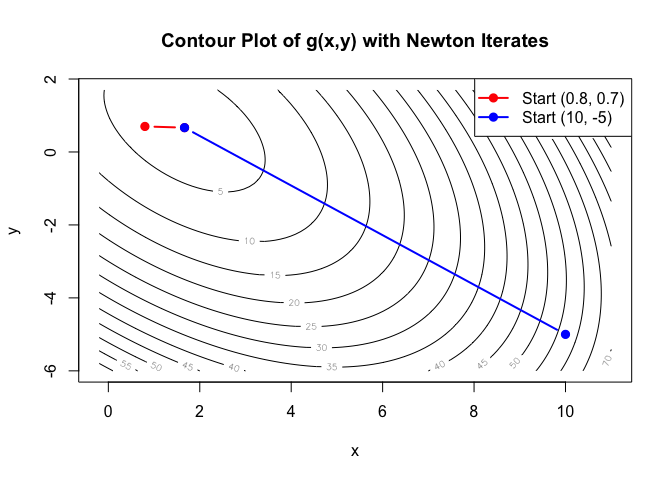

Homework on Newton’s methods
================
Leave your name and uni here

# Problem 1: Univariate optimizations.

In this problem, you will compare three common methods for univariate
minimization:Newton’s Method, Bisection Method and Golden-Section
Search.

## Function A:

$$f_1(x) = \ln(1+x^2)+x^2$$

## Function B:

$$f_2(x) = x^4 -6x^2+4x+8$$

## Answer the following questions:

# Answer:

``` r
# 2.
# install.packages("rootSolve")
library(rootSolve)

f1 <- function(x) log(1 + x^2) + x^2
f1_first <- function(x) (2*x)/(1 + x^2) + 2*x
f1_second <- function(x) 2*(x^4 + x^2 + 2) / (1 + x^2)^2

f2 <- function(x) x^4 - 6*x^2 + 4*x + 8
f2_first <- function(x) 4*x^3 - 12*x + 4
f2_second <- function(x) 12*x^2 - 12
critical_points_f2 <- uniroot.all(f2_first, lower = -10, upper = 10)

# 3. find local minimum
# bisection
# we need dfa * dfb < 0
bisection <- function(df, a, b, tol = 1e-10){
  cur <- (a + b) / 2
  i <- 0
  while (abs(df(cur)) > tol){
    i <- i + 1
    if (df(a) * df(cur) > 0){
      a <- cur
    }else {
      b <- cur
    }
    cur <- (a + b) / 2
  }
  res <- c(cur, i)
  return(res)
}

# golden search
goldenSearch <- function(f, a, b, tol=1e-10){
  gr <- (sqrt(5) - 1) / 2
  x1 <- b - gr * (b - a)
  x2 <- a + gr * (b - a)
  i <- 0
  while(abs(b - a) > tol){
    i <- i + 1
    if (f(x1) < f(x2)){
      b <- x2
      x2 <- a + gr * (b - a) # can also be x1
      x1 <- b - gr * (b - a)
    }else{
      a <- x1
      x1 <- b - gr * (b - a) # can also be x2
      x2 <- a + gr * (b - a)
    }
  }
  res <- c((a + b) / 2, i)
  return (res)
}

# newton method
newtonMethod <- function(f, df, start, tol=1e-10){
  i <- 0
  x <- start
  while (abs(f(x)) > tol){
    i <- i + 1
    x <- x - f(x) / df(x)
  }
  res <- c(x, i)
  return(res)
}
set.seed(123)
# f1
a <- -2
b <- 1
res_f1_bisec <- bisection(f1_first, a, b)
res_f1_gs <- goldenSearch(f1, a, b)
res_f1_nt <- newtonMethod(f1_first, f1_second, a)

# f2
as <- c(-2, 0.9)
bs <- c(0, 2)
res_f2_bisec1 <- bisection(f2_first, as[1], bs[1])
res_f2_bisec2 <- bisection(f2_first, as[2], bs[2])

res_f2_gs1 <- goldenSearch(f2, as[1], bs[1])
res_f2_gs2 <- goldenSearch(f2, as[2], bs[2])

res_f2_nt1 <- newtonMethod(f2_first, f2_second, as[1])
res_f2_nt2 <- newtonMethod(f2_first, f2_second, as[2])

# 4.
comparison1 <- as.data.frame(rbind(c("bisection", res_f1_bisec, f1(res_f1_bisec[1])), 
                                  c("golden search", res_f1_gs, f1(res_f1_gs[1])),
                                  c("newton method", res_f1_nt, f1(res_f1_nt[1]))))
comparison1 <- comparison1 %>% 
  rename(name = "V1", root = "V2", iteration = "V3", result = "V4")
comparison1
```

    ##            name                  root iteration               result
    ## 1     bisection  1.45519152283669e-11        35 2.11758236813575e-22
    ## 2 golden search -5.79591141089835e-12        51 3.35925890829817e-23
    ## 3 newton method  4.58039842491341e-16         5 2.09800497309492e-31

``` r
comparison2 <- as.data.frame(rbind(c("bisection root 1", res_f2_bisec1, f2(res_f2_bisec1[1])),
                                   c("bisection root 2", res_f2_bisec2, f2(res_f2_bisec2[1])),
                                   c("golden search root 1", res_f2_gs1, f2(res_f2_gs1[1])),
                                   c("golden search root 2", res_f2_gs2, f2(res_f2_gs2[1])),
                                   c("newton method root 1", res_f2_nt1, f2(res_f2_nt1[1])),
                                   c("newton method root 2", res_f2_nt2, f2(res_f2_nt2[1]))))
comparison2 <- comparison2 %>% 
  rename(name = "V1", root = "V2", iteration = "V3", result = "V4")
comparison2
```

    ##                   name              root iteration            result
    ## 1     bisection root 1 -1.87938524156925        35 -8.23442238342932
    ## 2     bisection root 2  1.53208888624067        35  5.55437759271229
    ## 3 golden search root 1 -1.87938523016814        50 -8.23442238342932
    ## 4 golden search root 2  1.53208889529803        49  5.55437759271229
    ## 5 newton method root 1 -1.87938524157182         4 -8.23442238342932
    ## 6 newton method root 2  1.53208888623796         7  5.55437759271229

1.  

**function A: ** $f'_1(x) = \frac{2x}{1+x^2} + 2x$,
$f''_1(x) = \frac{2(x^4 +x^2 +2)}{(1+x^2)^2}$

**function B: ** $f'_2(x) = 4x^3 - 12x + 4$, $f''_2(x) = 12x^2 - 12$

2.  

To find whether functions are unimodal, we need to find root where first
prime of function is 0 and second prime of function is positive.

For **function A**, it is obvious that the first derivative of function
is 0 only when x = 0, and $f''_2(0) = 4 > 0$. Therefore, function A is
unimodal.

For **function B**, we use `library(rootSolve)` and find 3 root for
function B. is not unimodal.

3.  

The comparison of results for function A and B are presented above in
tables.

With result from question 2, we know that root of function B are:
-1.8794479, 0.3472831, 1.5320901, and their second derivatives are
30.3878946, -10.5527331, 16.1676027. Therefore, we only have 2 local
minimum.

4.  

According to the comparison tables, we first verify that the root of f1
is at 0 and the global minimum can also be considered as $f(0)=0$ . For
f2, we wisely choose the range and starting point in order to handle its
multi-modal. And by comparison, we find the global minimum of f2 is
-8.2344224 at root = -1.8793852. All methods agrees with the global
minimum for both functions, which indicate our estimation of global
minimum is valid.

The newton’s method is fastest in terms of iteration.

I think the Golden Search is the easiest method to apply if we only know
a broad range because we don’t need to know the expression of
derivatives of function. Also, bisection and newton methods are root
finding methods, but for golden search, we can implement it to obtain
either maximum or minimum.

Newton’s Method is most prone to failure or poor convergence when
initial guess is bad. if initial guess is too far or its second
derivative is too close to 0, then the method might diverge to another
search region or crash(denominator=0).

Shape of function influences:

- Bisection because it requires the signs of first derivative of the
  range we choose to be different. Therefore, if we don’t properly
  choose the interval, other critical points might be included.

- Golden Search because it assumes unimodality of our function. If there
  is multiple modals, we need to isolate each of them.

- Newton Method because the second derivative of the function(local
  curvature) can influence convergence significantly.

# Problem 2: Newton’s Method in Two Dimensions

$g(x,y)$ is a 2D funciton $$g(x,y) = x^2+xy+y^2-4x-3y+7$$ \## Answer the
folling questions:

# Answer: your answer starts here…

1.  $\Delta g(x,y) = (^{2x + y-4}_{x+2y-3})$ ,
    $\Delta^2 g(x,y) = \left(\begin{array}{cc} 2 & 1\\ 1 & 2\end{array}\right)$

``` r
# 2. 
set.seed(123)
grad <- function(x, y) {
  c(2*x + y - 4,  x + 2*y - 3)
}
hess <- matrix(c(2, 1,
              1, 2), nrow = 2, byrow = TRUE)
newtonRalphson <- function(x0, y0, grad, hess, tol=1e-10, max_iter=500){
  i <- 0
  x <- x0
  y <- y0
  hess_inv <- solve(hess)
  g_val <- grad(x, y)
  res <- c(x, y, g_val, i)
  prev_x <- -Inf
  prev_y <- -Inf
  while(i < max_iter && (x-prev_x > tol) && (y-prev_y > tol)){#sqrt(sum(g_val^2)) > tol){
    i <- i + 1
    curr <- hess_inv %*% g_val
    prev_x <- x
    prev_y <- y
    x <- x - curr[1]
    y <- y - curr[2]
    g_val <- grad(x, y)
    res <- rbind(res, c(x, y, g_val, i))
  }
  return(res)
}

res_table1 <- newtonRalphson(0.8, 0.7, grad, hess)
res_table2 <- newtonRalphson(10, -5, grad, hess)

res_table1
```

    ##         [,1]      [,2] [,3] [,4] [,5]
    ## res 0.800000 0.7000000 -1.7 -0.8    0
    ##     1.666667 0.6666667  0.0  0.0    1

``` r
res_table2
```

    ##          [,1]       [,2]         [,3] [,4] [,5]
    ## res 10.000000 -5.0000000 1.100000e+01   -3    0
    ##      1.666667  0.6666667 1.776357e-15    0    1

``` r
g <- function(x, y) {
  x^2 + x*y + y^2 - 4*x - 3*y + 7
}

all_x <- c(res_table1[,1], res_table2[,1])
all_y <- c(res_table1[,2], res_table2[,2])
x_range <- range(all_x)
y_range <- range(all_y)
x_vals <- seq(x_range[1] - 1, x_range[2] + 1, length.out = 100)
y_vals <- seq(y_range[1] - 1, y_range[2] + 1, length.out = 100)

# Compute the function values on the grid.
z_vals <- outer(x_vals, y_vals, g)

# Plot the contour
contour(x_vals, y_vals, z_vals, nlevels = 20, 
        xlab = "x", ylab = "y", 
        main = "Contour Plot of g(x,y) with Newton Iterates")

lines(res_table1[,1], res_table1[,2], type = "b", col = "red", pch = 19, lwd = 2)
points(res_table1[,1], res_table1[,2], col = "red", pch = 19)

lines(res_table2[,1], res_table2[,2], type = "b", col = "blue", pch = 19, lwd = 2)
points(res_table2[,1], res_table2[,2], col = "blue", pch = 19)

# Add a legend
legend("topright", legend = c("Start (0.8, 0.7)", "Start (10, -5)"), 
       col = c("red", "blue"), pch = 19, lwd = 2)
```

<!-- -->

# Problem 3

Suppose we have data $(x_i,y_i), i=1,...,n,$ with $y_i$ follows a
conditional expotential distribution

$$Y_i \mid x_i \sim \exp(\lambda_i), \mbox{ where } \log(\lambda_i) =\alpha + \beta x_i.$$

## Please complete the following tasks:

# Answer:

1.  Since the conditional distribution is exponential, we use its pdf
    and then we have
    $l(\alpha, \beta) = ln \prod^{n}_{i=1}[\lambda_i]e^{-\lambda_iy_i} = \sum^{n}_{i=1}[ln(\lambda_i) - \lambda_i y_i] = \sum^{n}_{i=1}[\alpha + \beta x_i-y_i e^{\alpha + \beta x_i}]$

Gradient:
$\nabla L(\alpha,\beta)=\begin{pmatrix}n - \sum_{i=1}^n y_i\, e^{\alpha+\beta x_i} \\[6pt]\sum_{i=1}^n x_i \;-\; \sum_{i=1}^n \bigl(x_i\, y_i\, e^{\alpha+\beta x_i}\bigr)\end{pmatrix}.$

Hessian:
$\nabla^2 L(\alpha,\beta)=\begin{pmatrix}-\sum_{i=1}^n y_i\, e^{\alpha+\beta x_i}&-\sum_{i=1}^n x_i\, y_i\,e^{\alpha+\beta x_i}\\[6pt]-\sum_{i=1}^n x_i\, y_i\, e^{\alpha+\beta x_i}&-\sum_{i=1}^n x_i^2\, y_i\, e^{\alpha+\beta x_i}\end{pmatrix}.$

``` r
# 2
n <- 200
alpha_true <- 0.5
beta_true  <- 1.2
set.seed(123)
x <- runif(n, 0, 1)
# Generate predictor values (x_i)
lambda <- exp(alpha_true + beta_true * x)

# Generate y_i ~ Exp(rate = lambda_i)
y <- rexp(n, rate = lambda)

df <- data.frame(x = x, y = y)

# 3. Newton method for MLE of conditional dist
loglik_expreg <- function(alpha, beta, x, y){
  lambda <- exp(alpha + beta * x)
  val <- sum((alpha + beta * x) - y * lambda)
  return (val)
}

grad_expreg <- function(alpha, beta, x, y) {
  lambda <- exp(alpha + beta * x)
  d_alpha <- length(x) - sum(y * lambda)
  d_beta  <- sum(x) - sum(x * y * lambda)
  return(c(d_alpha, d_beta))  # 2x1 vector
}

hess_expreg <- function(alpha, beta, x, y) {
  lambda <- exp(alpha + beta * x)
  term   <- y * lambda  # common term y_i e^{alpha+beta x_i}
  
  h11 <- -sum(term)            # d^2/dalpha^2
  h22 <- -sum(x^2 * term)      # d^2/dbeta^2
  h12 <- -sum(x * term)        # d^2/dalpha dbeta = d^2/dbeta dalpha
  H <- matrix(c(h11, h12,
                h12, h22),
              nrow = 2, byrow = TRUE)
  return(H)
}

newton_expreg <- function(x, y, alpha_init = 0, beta_init = 0,
                          tol = 1e-8, max_iter = 100) {
  alpha <- alpha_init
  beta <- beta_init
  i <- 0
  prev_loglik <- -Inf
  curr_loglik <- loglik_expreg(alpha, beta, x, y)
  
  while (i < max_iter && abs(curr_loglik - prev_loglik) > tol) { # or compute gradient norm sqrt(sum(g^2))
    i <- i+1
    g <- grad_expreg(alpha, beta, x, y)
    H <- hess_expreg(alpha, beta, x, y)
    
    # Update alpha, beta via Newton step
    update <- solve(H, g)  # H^{-1} * g
    alpha <- alpha - update[1]
    beta  <- beta  - update[2]
    
    # Update log-likelihood
    prev_loglik <- curr_loglik
    curr_loglik <- loglik_expreg(alpha, beta, x, y)
  }
  return (list(alpha = alpha,
              beta  = beta,
              loglik = curr_loglik,
              iter = i))
}

res_newtonRalphson <- newton_expreg(x, y,
                           alpha_init = 0, beta_init = 0,
                           tol = 1e-10, max_iter = 200)

# 4. step halving at the end when ascent direction
modified_newton_expreg <- function(x, y,
                                   alpha_init = 0,
                                   beta_init  = 0,
                                   tol = 1e-8,
                                   max_iter = 100) {
  
  alpha <- alpha_init
  beta  <- beta_init
  i     <- 0
  
  prev_loglik <- -Inf
  curr_loglik <- loglik_expreg(alpha, beta, x, y)
  
  while (i < max_iter && abs(curr_loglik - prev_loglik) > tol) {
    i <- i + 1
    
    # Compute gradient and Hessian
    g <- grad_expreg(alpha, beta, x, y)    # a 2-vector
    H <- hess_expreg(alpha, beta, x, y)    # a 2x2 matrix
    
    # Newton update is effectively -H^-1 * g
    update <- solve(H, g)                 # H^-1 g
    # The "Newton direction" in terms of "move" is -update:
    d_newton <- -update
    
    # Check if d_newton is ascent
    dir_check <- sum(g * d_newton)     
    if (dir_check <= 0) {
      # fallback: use gradient direction
      d <- g
    } else {
      d <- d_newton
    }
    
    # Step-halving line search
    step <- 1
    old_loglik <- curr_loglik
    # Proposed new parameters
    new_alpha <- alpha + step * d[1]
    new_beta  <- beta  + step * d[2]
    new_loglik <- loglik_expreg(new_alpha, new_beta, x, y)
    
    # While new log-likelihood <= old, reduce step
    while (step > 1e-14 && new_loglik <= old_loglik) {
      step <- step / 2
      new_alpha <- alpha + step * d[1]
      new_beta  <- beta  + step * d[2]
      new_loglik <- loglik_expreg(new_alpha, new_beta, x, y)
    }
    
    # Update alpha, beta, loglik
    prev_loglik <- curr_loglik
    alpha <- new_alpha
    beta  <- new_beta
    curr_loglik <- new_loglik
  }
  
  list(alpha = alpha,
       beta  = beta,
       loglik = curr_loglik,
       iter = i)
}


# 5. Fisher score modified
newton_expreg_fisher <- function(x, y, 
                                 alpha_init = 0, beta_init = 0,
                                 tol = 1e-8, max_iter = 100) {
  # Initialize parameters
  alpha <- alpha_init
  beta  <- beta_init
  i <- 0
  prev_loglik <- -Inf
  curr_loglik <- loglik_expreg(alpha, beta, x, y)
  
  while (i < max_iter && abs(curr_loglik - prev_loglik) > tol) {
    i <- i + 1
    g <- grad_expreg(alpha, beta, x, y)
    
    # Compute the Fisher Information matrix.
    I_mat <- matrix(c(length(x), sum(x),
                      sum(x),      sum(x^2)),
                    nrow = 2, byrow = TRUE)
    
    # Compute the Fisher scoring update:
    # update = I^{-1} * g. (For maximization, we add this update.)
    update <- solve(I_mat, g)
    
    
    # Step-halving (line search) to ensure an increase in log-likelihood.
    step <- 1
    old_loglik <- curr_loglik
    new_alpha <- alpha + step * update[1]
    new_beta  <- beta  + step * update[2]
    new_loglik <- loglik_expreg(new_alpha, new_beta, x, y)
    
    while (step > 1e-14 && new_loglik < old_loglik) {
      step <- step / 2
      new_alpha <- alpha + step * update[1]
      new_beta  <- beta  + step * update[2]
      new_loglik <- loglik_expreg(new_alpha, new_beta, x, y)
    }
    
    # Update the parameters and log-likelihood
    prev_loglik <- curr_loglik
    alpha <- new_alpha
    beta  <- new_beta
    curr_loglik <- new_loglik
  }
  
  return(list(alpha = alpha,
              beta  = beta,
              loglik = curr_loglik,
              iter = i))
}

res_orig   <- newton_expreg(x, y, alpha_init = 0, beta_init = 0, tol = 1e-10, max_iter = 200)
res_mod    <- modified_newton_expreg(x, y, alpha_init = 0, beta_init = 0, tol = 1e-10, max_iter = 200)
res_fisher <- newton_expreg_fisher(x, y, alpha_init = 0, beta_init = 0, tol = 1e-10, max_iter = 200)

# Create a comparison table
results <- data.frame(Method = c("Original Newton", "Modified Newton", "Fisher Scoring"),
                      Alpha = c(res_orig$alpha, res_mod$alpha, res_fisher$alpha),
                      Beta  = c(res_orig$beta,  res_mod$beta,  res_fisher$beta),
                      LogLik = c(res_orig$loglik, res_mod$loglik, res_fisher$loglik),
                      Iterations = c(res_orig$iter, res_mod$iter, res_fisher$iter))

print(results)
```

    ##            Method     Alpha     Beta   LogLik Iterations
    ## 1 Original Newton 0.2974917 1.554776 16.96356          8
    ## 2 Modified Newton 0.2974917 1.554776 16.96356          5
    ## 3  Fisher Scoring 0.2974917 1.554776 16.96356          7

6.  Based on the comparison table above, we found that all methods can
    find the MLE quickly and the modified newton ralphson with ascent
    check and step halving is the fastest as we expected. All three
    methods agrees on an optimum, which indicates our result is valid.
